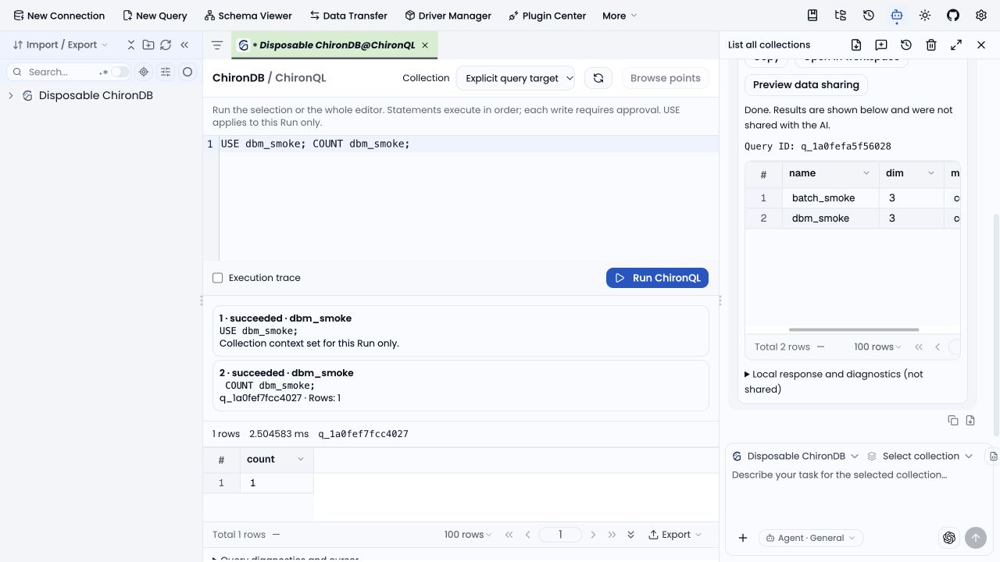

# Stable upstream integration for Horizon 0.1.3

Source: [DBX v0.6.31](https://github.com/t8y2/dbx/releases/tag/v0.6.31), released 2026-10-02. Baseline: Horizon `main` at `0a3f5b487`, previously synchronized through upstream 0.6.16. Release version: 0.1.3.

The upstream crate extraction required resolving the fork at logical module boundaries. Horizon-specific transport, migration, credential handling, and UI workflows were carried into the new workspace. The upstream tag is recorded as an integration parent so later synchronizations have a correct merge base.

## Preservation checklist

| Horizon capability | Integration and evidence |
| --- | --- |
| Branding and appearance | Application ID, icons, Poppins/Black theme, canonical repository and version preserved; branding audit and theme tests |
| Native ChironDB | HTTP transport extracted into drivers; connector integration tests and live disposable database smoke |
| ChironQL scripts | Sequential statements, run-local USE, cancellation and exact write approvals; script tests and live browser execution |
| Native assistant | Restored in the newer frozen-connection conversation UI; lifecycle, prompt, result and live approval/privacy tests |
| ChironDB Relational | PostgreSQL-wire profile and access registration retained; database availability tests |
| Schema Viewer | Existing modes and metadata-only adapters retained and registered through the new Tauri schema crate; affected frontend/Rust tests |
| Profile and export migration | Legacy paths, environment fallbacks, encrypted material and browser storage compatibility retained; migration/compatibility tests |
| Credential storage and sync | Native envelope survives generalized migration; encrypted upstream secrets migrate on load; CLI/proxy fields remain encrypted; credential and sync tests |
| Database version monitor | Configuration and generated availability preserved; monitor tests |
| English documentation | English public route set and 42 content pages retained; content check and documentation type check |
| Plugins and distribution | Canonical package extension; custom repository trust retained; unconfigured official services disabled; installer/runtime/SDK tests |

## Measured local results

- Frontend: 1,630 suites and 19,389 tests passed.
- Rust core: 2,969 passed, 8 ignored; credentials: 7 passed; ChironDB connector: 14 passed.
- Platform/plugin runtime/SQL dialect: 325 passed; plugin CLI: 23 passed.
- Java agent test and shaded-JAR build passed; manifest and packaging validation passed.
- Desktop and documentation type checks, native desktop compilation, production frontend build, branding audit, and whitespace checks passed.
- Live smoke tests used real local ChironDB plus a synthetic local AI provider; external AI providers and other live database engines were not exercised by that smoke run.

## Validation commands

Use Node.js 22, pnpm 10.27.0, Rust 1.94.1, JDK 21, and a compatible Go toolchain. Large type checks require `NODE_OPTIONS=--max-old-space-size=6144`. Debug Rust tests require `RUST_MIN_STACK=16777216`.

```sh
node scripts/audit-branding.mjs
node scripts/sync-connection-types.mjs --check
pnpm exec vue-tsc --noEmit -p apps/desktop/tsconfig.json
pnpm exec vitest run
pnpm test:database-availability
pnpm build
pnpm build:docs-export
pnpm --dir docs content:check
node --test scripts/core-architecture.test.mjs scripts/release.test.mjs
cargo test -p chiron-horizon-core --no-default-features --features sqlite-bundled --lib
cargo test -p chiron-horizon-core --no-default-features --features sqlite-bundled --test ai_credentials --test chirondb_connector
cargo test -p chiron-horizon-platform -p chiron-horizon-plugin-runtime -p chiron-horizon-sql-dialect --no-default-features --lib
cargo test --manifest-path plugins/sdk/cli/Cargo.toml
cargo check -p chiron_horizon
(cd agents && ./gradlew test shadowJar --no-daemon && python3 scripts/validate_agents.py && python3 scripts/validate_agent_jars.py)
(cd agents/scripts && python3 -m unittest validate_agents_test.py driver_release_packages_test.py)
```

Run `go test ./...` in each changed Go agent module. Build `chiron-horizon-web`, then run `scripts/chirondb-smoke.mjs` with `CHIRONDB_TEST_BINARY` and `DBM_TEST_BINARY` pointing to local binaries. The smoke script creates a disposable profile, local mock AI provider, and temporary ChironDB data; it does not use user databases or provider credentials.

Before publication, native verification jobs must pass, the PR must merge into main, and the annotated tag must match `src-tauri/tauri.conf.json`. The release workflow builds and checks the published platform and driver assets. No new code-signing identity, hosted plugin catalog, package-manager publication, or automatic updater is introduced.

## Browser verification

A disposable ChironDB profile completed `USE dbm_smoke; COUNT dbm_smoke;` and a native assistant `SHOW COLLECTIONS;` request. The UI displayed successful statement results and confirmed that assistant results remained local.


